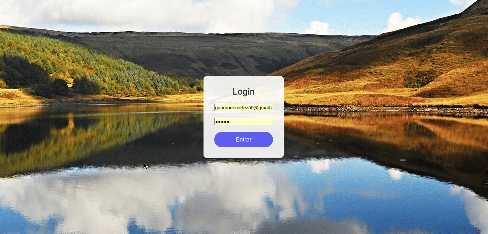

# Monitoramento de Reservatórios d'Água



Este projeto é um **sistema de monitoramento de reservatórios de água**, desenvolvido com **Laravel**, **Docker** e **PostgreSQL**. O sistema coleta dados de níveis de água em tempo real, enviados por um microcontrolador, e os armazena em um banco de dados. Com base nesses dados, o sistema processa e exibe informações de fácil acesso para o administrador, permitindo o acompanhamento e a gestão eficiente dos reservatórios.

## Funcionalidades do Sistema

O sistema fornece ao administrador os seguintes dados:

- **Volume**: Exibe o armazenamento atual, a capacidade total e a quantidade armazenada no reservatório.
- **Vazão**: Indica quanto o volume do reservatório aumentou ou diminuiu ao longo do tempo.
- **Retenção**: Mede o volume total retido (reduções no volume).
- **Velocidade de Vazão e Retenção**: Quantifica as mudanças de volume em relação ao tempo.

# Instalação

#### Passo 1: Clonar o Repositório

No terminal, clone o repositório e navegue até o diretório do projeto:

```bash
git clone https://github.com/gabrielandradecunha/monitoramento-reservatorio/
cd monitoramento-reservatorio
```

#### Passo 2: Subir o Container do PostgreSQL

Utilize o Docker Compose para subir o container do PostgreSQL:

```bash
sudo docker-compose up -d
```

#### Passo 3: Instalar Dependências

Instale as dependências do projeto utilizando o Composer:

```bash
composer install
```

#### Passo 4: Configurar o Ambiente

Crie o arquivo `.env` com as credenciais corretas para conexão com o banco de dados PostgreSQL:

```bash
mv .env.example .env
```

#### Passo 5: Executar as Migrações

Rodar as migrações para criar as tabelas no banco de dados:

```bash
php artisan migrate
```

#### Passo 6: Rodar Seeders

Execute as seeders para criar o usuário **Administrator**, que permitirá o acesso ao sistema:

```bash
php artisan db:seed
```

#### Passo 7: Criar o Gatilho no Banco de Dados

É necessário criar um gatilho no banco de dados para registrar o histórico de alterações feitas pelo microcontrolador. Para isso, execute o script `init.sql`:

```bash
sudo docker exec -it postgres_monit psql -U postgres -d postgres -f /docker-entrypoint-initdb.d/init.sql
```

# Instalação via Docker

Alternativamente, você pode rodar a aplicação em um container Docker.

##### Passo 1: Clonar o Repositório

No terminal, clone o repositório e navegue até o diretório do projeto:

```bash
git clone https://github.com/andradesysadmin/monitoramento-reservatorio/
cd monitoramento-reservatorio
```

#### Passo 2: Subir o Container do PostgreSQL

Suba o container do PostgreSQL com o Docker Compose:

```bash
sudo docker-compose up -d
```

#### Passo 3: Criar o Arquivo `.env`

Crie o arquivo `.env` apropriado para a aplicação em container (ou utilize o meu arquivo `.docker.env`):

```bash
sudo cp .docker.env .env
```

#### Passo 4: Construir e Subir o Container

Construa e suba o container da aplicação:

```bash
sudo docker build -t sysmonit .
sudo docker run -d --network monitoramento-reservatorio_monit -p 8080:8000 --name sysmonit sysmonit
```

#### Passo 5: Executar as Migrações e Seeders

Como as migrações não podem ser executadas no momento de build da imagem (pois o container ainda não está na rede), execute as migrações e seeders após subir o container na rede do banco de dados:

```bash
sudo docker exec -it sysmonit php artisan migrate
sudo docker exec -it sysmonit php artisan db:seed
```

#### Passo 6: Criar o Gatilho no Banco de Dados

Por fim, crie o gatilho no banco de dados para registrar o histórico de alterações feitas pelo microcontrolador com o script `init.sql`:

```bash
sudo docker exec -it postgres_monit psql -U postgres -d postgres -f /docker-entrypoint-initdb.d/init.sql
```

## Conclusão

Caso tenha alguma dúvida ou problema, pode abrir uma issue no repositório ou me contatar diretamente
